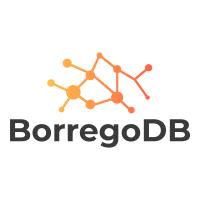
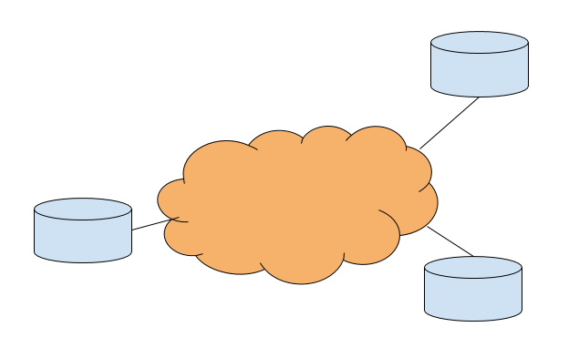

# Borrego DB



## Api and Client for Borrego DB - an encrypted distributed NoSQL database

  
*BorregoDb as a distrbuted database*

BorregoDB is an encrypted distributed NoSQL database. It is encrypted and
distributed in the sense that both data and indexes are encrypted and distributed.
This means that data can be stored encrypted on any device or machine anywhere and still be
queryable. Database indexes are also encrypted and distributed, meaning an index can
also be split across any machine. This enables data to be queryied from anywhere
in the network but with very fine grained access control. It may be possible to query and
find the encrypted data, but not decrypt it without explicit authorization. Data may be
split across many differences devices and machines for security purposes, or data may be stored
on differences machines because it was generated there. Of course, data can also be stored
on a single machine and act as a database server.

BorregoDB provides a native Java API that uses Maps to construct data records and to make
queries while also supporting basic SQL CRUD operations. In the close future, a REST API
supporting JSON and SQL queries will also be made available.

Here are a few example configurations:

1. Data is generated on many different machines. Data is inserted, encrypted and stored
on each machine. Data from all machines is queryable from any machine or user in the network provided
they have the correct credentials.

2. Sensitive data is generated on one machine, data is inserted and stored across many different
machines. Data from all machines is queryable from any machine or user in the network provided
they have the correct credentials.

3. (Variation of 1.). Data is generated on many different machines. Data is inserted, encrypted and stored
on each machine. Data from all machines is queryable from any machine in the network provided
the have the correct credentials, but only a subset of users can decrypt the data.

4. (Variation of 3.). Data is generated on many different machines. Data is inserted, encrypted and stored
on each machine. Data from all machines is queryable from any machine in the network provided
they have the correct credentials, but only a subset of the data can be decrypted. 

5. (Variation of 4.). Data is generated on many different machines. Data is inserted, encrypted and stored
on each machine. Data from all machines is queryable from a subset of machines in the network provided
the have the correct credentials, but only a subset of the data can be decrypted. 

6. (Variation of 5.). Data is generated on many different machines. Data is inserted, encrypted and stored
on each machine. Data from a select subset of machines is queryable from a select subset of machines in the network provided they have the correct credentials, but only a subset of the data can be decrypted. 

In summary BorregoDB provides the capability to query data stored on many different locations
on the network (including the Internet) while controlling who can query the data and who can
decrypt the data. 

This infrastructure also provides the capability to perform more advanced function than simple queries,
but also computations on the encrypted data, which is something that will be provided in future updates.


## Installing and starting BorregoDB

The first step to and installing and running BorregoDB is to download and
installing the BorregoDB docker image.
If Docker hasn't been installed, please install that first. On Ubuntu/Debian this
can be done with the following command:

```bash
$ sudo apt-get update
$ sudo apt-get install docker
```

In order to install, start, stop and manage the borrego db docker app, a
helper python script is provided called `bctl.py` is provided.
To install the borrego image:
```bash
./bctl.py
Enter borrego command:
Command: pull
```

After this we can start a new borrego docker container:
```bash
./bctl.py
Enter borrego command:
Command: run
root@4bd5d94ea14b:/app#
```

This starts the new borrego and takes you straight to the command line
of the container. 

Each node that runs borrego needs to have unique NDN name. If you are using
a private NDN network, or if you are only using Borrego locally on a single machine,
you can choose any name you want. In the example below, we choose the name `node1`. To
initialize borrego db in the container, use the following syntax on the command line
inside the container:

```
borrego <node_name>
```

For example

```bash
root@4bd5d94ea14b:/app# borrego node1
Borrego should be fully started
root@4bd5d94ea14b:/app# exit

```

Borrego DB should now be running in the Docker container and be accessible to other 
applications and services.

## API library and Command Line Interface (CLI) driver application

In order to use BorregoDB within a Java application, the provided Java library application
can be used to make queries and insert new data. The java jar file can either be executed
on the command and function as a CLI application to make quick queries, or be linked in
to a Java application as an external library.

BorregoDB can either can accessed using a simplified version of SQL to make queries
and other CRUD operation. When using the CLI application, currently only SQL syntax is
supported, although in the near future, JSON type queries will also be supported.

### Compiling the driver 
```bash
$ mvn clean compile assembly:single
```

### Using the driver as a CLI

```bash
./borrego_cli.sh 
Welcome to Borrego! 

borrego=# 
```

### Insert some data

Let's insert some data using standard SQL INSERT syntax.

```bash
borrego=# insert into test_table (id, name, age) values (1, 'Alice', 26)
borrego=# insert into test_table (id, name, age) values (2, 'Bob', 28)
borrego=# insert into test_table (id, name, age, info) values (3, 'Carol', 30, 'Expert on Cryptography')
borrego=# insert into test_table (id, name, credit) values (4, 'David', 200)
```

Although SQL can be used, Borrego DB is a document based NoSQL database and there is no need 
to create a "table"; it will be automatically created and indexed. The name *table* is used
loosely here and is used for historical and conventional reasons; data doesn't have to be 
modelled as a table, although it is certainly possible to do so. Also note that, BorregoDB
is schema less and documents stored in the same table doesn't have to follow the same format.

### Making queries

Now let's make a simple querie that retrieves all documents:

```bash
borrego=# select * from test_table
[
  {
    "id": 1,
    "name": "Alice",
    "age": 26
  },
  {
    "id": 3,
    "name": "Carol",
    "age": 30,
    "info": "Expert on Cryptography"
  },
  {
    "id": 2,
    "name": "Bob",
    "age": 28
  },
  {
    "id": 4,
    "name": "David",
    "credit": 200
  }
]

```

The query retrieves our created as expected and is printed in JSON format. Even though 
different documents may have different formats and contain different fields, it still is 
possible to make queries on all the fields present in the table:

```bash
borrego=# select * from test_table where age > 27
[
  {
    "id": 2,
    "name": "Bob",
    "age": 28
  },
  {
    "id": 3,
    "name": "Carol",
    "age": 30,
    "info": "Expert on Cryptography"
  }
]

borrego=# select * from test_table where credit > 100
[
  {
    "id": 4,
    "name": "David",
    "credit": 200
  }
]
```

The BorregoDB indexer indexing the documents based on those fields that are present, creating
more flexibility for the users to create documents and data with more advanced structures.

## Java API library driver

This repo also provides a Java API library driver than can be used by applications to perform
database CRUD operations. With the library, operations can either be performed using the
SQL syntax as described above, or using a maps. Each data record is then entered as a
`Map<String, Object>` object that can contain many different data types in many different
nested as needed. Note that currently, nested data records can only be inserted with the
Java API, although in the near future it will also be possible to enter using JSON objects
and through a REST API.

### Inserting data with the Java API

Below is a simple example of how to enter data into borrego:
```java
BorregoApi api = new BorregoApi();

//Insert some data
Map<String, Object> data = new LinkedHashMap<String, Object>();
data.put("id", 1);
data.put("name", "Alice");
data.put("age", 26);
api.insertData("test_table", data);

data = new LinkedHashMap<String, Object>();
data.put("id", 2);
data.put("name", "Bob");
data.put("age", 28);
api.insertData("test_table", data);

data = new LinkedHashMap<String, Object>();
data.put("id", 3);
data.put("name", "Carol");
data.put("age", 30);
data.put("info", "Expert on Cryptography");
api.insertData("test_table", data);

data = new LinkedHashMap<String, Object>();
data.put("id", 4);
data.put("name", "David");
HashMap<String, Object> nestedData = new LinkedHashMap<String, Object>();
nestedData.put("age", 25);
nestedData.put("balance", 80);
nestedData.put("credit", 20);
data.put("info", nestedData);
api.insertData("test_table", data);

```

### Retrieve all data from a table using the Java API

```java
// Querying with an empty map means retrieve all records
Map<String, Object> query = new LinkedHashMap<String, Object>();
List<Map<String, Object>> resultMapQuery = api.queryData("test_table", query);
System.out.println("Java Query All Result: " + resultMapQuery);
```
Within Borrego DB each record is stored as a `Map<String, Object>` objects and
all queries return a List of found records as a `List<Map<String, Object>>` object.

### Making specific queries using the Java API

In order to make specific queries that match individual fiels, simply
add that field and value for the query map:

```java
Map<String, Object> query = new LinkedHashMap<String, Object>();
query.put("id", 2);
List<Map<String, Object>> resultMapQuery = api.queryData("test_table", query);
```

If printed, this query would look like the following:
```bash
{id=2}
```


### Making specific queries with conditions using the Java API

In order to make conditional queries using `>, >=, <, <=` with the Java API, 
a query Map needs to be specified using the keywords `$gt, $gte, $lt, $lte`.

```java
Map<String, Object> query = new LinkedHashMap<String, Object>();
Map<String, Object> queryCondition = new LinkedHashMap<String, Object>();
queryCondition.put("$gte", 25);
queryCondition.put("$lt", 27);
query.put("age", queryCondition);

List<Map<String, Object>> foundData = api.queryData("test_table", query);
```

In the example above, a query is executed looking records where the age
field is greater than or equal to 25 and less than 27. If printed, this
query would look like the following:
```bash
{age={$gte=25, $lt=27}}
```

### Making nested queries using the Java API

As seen above, it is possible to make queries on specific fields, even when
those fields are nested. It is also possible to specify the nested path
to the field that is of interest to query, for example:

```java
Map<String, Object> query = new LinkedHashMap<String, Object>();
query.put("info.age", 25);
List<Map<String, Object>> foundData = api.queryData("test_table", query);
```
If printed, this query would look like the following:
```bash
{info.age=25}
```

### Making queries using OR conditions Java API

In order to make queries using the Java using OR conditions,
the different conditions needs to put into a list, and then
that list should be added to the query map with the key called
`$or`. For example:

```java
Map<String, Object> query = new LinkedHashMap<String, Object>();
Map<String, Object> ageConditionInner = new LinkedHashMap<String, Object>();
ageConditionInner.put("$gte", 25);
ageConditionInner.put("$lt", 27);
Map<String, Object> ageCondition = new LinkedHashMap<String, Object>();
ageCondition.put("age", ageConditionInner);
Map<String, Object> idCondition = new LinkedHashMap<String, Object>();
idCondition.put("id", 2);

List<Map<String, Object>> orList = new ArrayList<Map<String, Object>>();
orList.add(idCondition);
orList.add(ageCondition);
query.put("$or", orList);

List<Map<String, Object>> foundData = api.queryData("test_table", query);

```

If printed, this query would look like the following:
```java
{$or=[{id=2}, {age={$gte=25, $lt=27}}]}
```

### Deleteing data using the Java API

Deleting data works the same way as queries, where a query map is
provided but now the query specifies which records that is to be deleted:

```java
Map<String, Object> delQuery = new LinkedHashMap<String, Object>();
delQuery.put("id", 2);
api.deleteData("test_table", delQuery);

```

In SQL this would be eqvivalent to:
```bash
borrego=# delete from test_table where id = 2
```

## Connecting BorregoDB instances running on different nodes and devices

Borrego is a distributed encrypted database, and it can
easily query data located on other nodes or elsewhere in the
network, but Borrego currently needs to be configured with
the names of these nodes and their location in the form
of an IP address. The syntax to connect to a node is:

```bash
borrego_route <node_name> <node_ip_address>
```

For example, if a second node `node2` want to
query and share data with node1 located on
`192.168.121.1` it can run the `borrego_route command as follows
(note that this needs to execute within the borrego container):

```bash
./bctl.py
Enter borrego command:
Command: sh
root@4bd5d94ea14b:/app# borrego node2
Borrego should be fully started
root@4bd5d94ea14b:/app# borrego_route node1 192.168.121.1
root@4bd5d94ea14b:/app# exit
```

In order to actually make queries on, node2 also
needs to load the index manifests of node1. This is 
done with the `index` command which can be issued
via the command line or the API:

```bash
./borrego_cli.sh 
Welcome to Borrego! 

borrego=# index node1
borrego=# select * from test_table
[
  {
    "id": 1,
    "name": "Alice",
    "age": 26
  },
  {
    "id": 3,
    "name": "Carol",
    "age": 30,
    "info": "Expert on Cryptography"
  },
  {
    "id": 2,
    "name": "Bob",
    "age": 28
  },
  {
    "id": 4,
    "name": "David",
    "credit": 200
  }
]

```
## Future versions

Direct support for Android and iOS and general machines is under development.
Embedded support for various Machine Learning algorithms and execution of functional
operations on the encrypted is also under development.


## License

All code and scripts in this repo is available under the Apache v2 license, see attached license file.
Please note that this initial first release is using relying on a docker image 
which is availble to run free of charge for non commerical purposes. For commerical use,
please contact info@telhoc.com. There is an extended enterprise version of BorregoDB available
with development support, where more advanced security configurations can be done.


